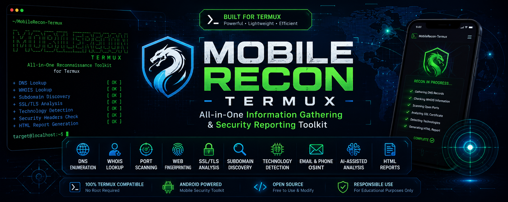

# 📱 MobileRecon-Termux


# MobileRecon-Termux

## Overview

MobileRecon-Termux is an all-in-one information gathering and security reporting toolkit designed for Android Termux users.


## Overview

MobileRecon-Termux is an all-in-one information gathering and security reporting toolkit designed for Android Termux users.

This project provides useful tools for domain analysis, DNS lookups, WHOIS information, SSL certificate inspection, security header analysis, and professional report generation.

---

## Features

- DNS Lookup
- WHOIS Lookup
- IP Information
- SSL Certificate Analysis
- Security Header Analysis
- Password Generator
- HTML Report Generator
- Termux Friendly Interface

---

## Installation

```bash
pkg update -y
pkg upgrade -y

pkg install git python -y

git clone https://github.com/tartpangit811-hub/MobileRecon-Termux.git

cd MobileRecon-Termux

pip install -r requirements.txt
```

## Usage

```bash
python mobilerecon.py
```

---

## Project Structure

```text
MobileRecon-Termux/
│
├── README.md
├── requirements.txt
├── mobilerecon.py
│
├── Modules/
│   ├── dns_lookup.py
│   ├── whois_lookup.py
│   ├── ssl_check.py
│   ├── headers.py
│   └── report.py
│
├── Images/
│   └── banner.png
│
└── Reports/
```

---

## Disclaimer

This project is intended for educational and authorized security assessment purposes only.

Always obtain permission before testing or analyzing systems.

---

## Author

Noel E. Rosas Jr.
